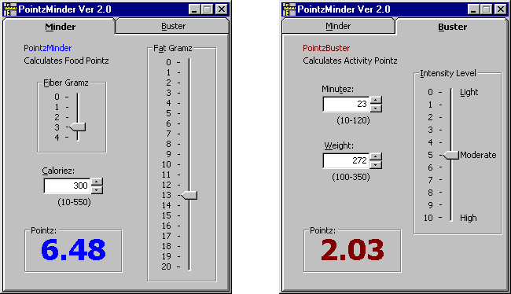

<div align="center">

## PointzMinder


</div>

### Description

This complete program calculates WW Food Points and Activity Points. It has been extensively debugged and tested by over 1000 users.
 
### More Info
 
On the first tab, the user inputs Caloriez, Fat Gramz, and Fiber Gramz. On the second tab, the user inputs Weight, Intensity Level, and Time.

The first tab calculates food pointz. The second tab calculates activity pointz.


<span>             |<span>
---                |---
**Submitted On**   |2001-09-06 11:19:26
**By**             |[Jim Clark](https://github.com/Planet-Source-Code/PSCIndex/blob/master/ByAuthor/jim-clark.md)
**Level**          |Advanced
**User Rating**    |5.0 (10 globes from 2 users)
**Compatibility**  |VB 5\.0, VB 6\.0
**Category**       |[Complete Applications](https://github.com/Planet-Source-Code/PSCIndex/blob/master/ByCategory/complete-applications__1-27.md)
**World**          |[Visual Basic](https://github.com/Planet-Source-Code/PSCIndex/blob/master/ByWorld/visual-basic.md)
**Archive File**   |[PointzMind26008962001\.zip](https://github.com/Planet-Source-Code/jim-clark-pointzminder__1-27025/archive/master.zip)

### API Declarations

```
RegCloseKey Lib
RegCreateKeyEx Lib
RegOpenKeyEx Lib
RegQueryValueExString
RegQueryValueExLong
RegQueryValueExNULL
RegSetValueExString
RegSetValueExLong
```


